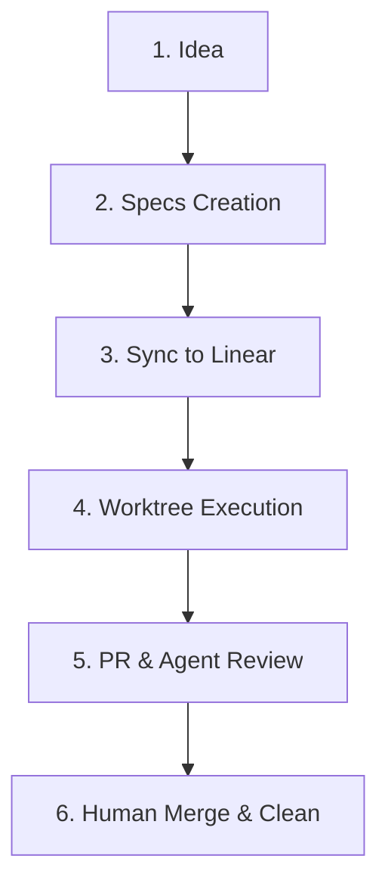

# Spec-Driven Development (SDD) Workflow Playbook

This document defines the official, repeatable Spec-Driven Development (SDD) workflow for the solo developer and AI agents collaborating on software projects.

English is the official language of communication. All issue titles, descriptions, code comments, documentation, and pull request reviews must be written in English.

---

## 🗺️ SDD Workflow Lifecycle

The workflow consists of five distinct phases from idea to merge.

### 1. Specification Phase (WHAT & WHY)
Before any coding starts, requirements must be formal and approved.
1. **Ideation:** Run `/cy-create-prd` to build the Product Requirements Document (`_prd.md`).
2. **Design:** Run `/cy-create-techspec` to build the Technical Specification (`_techspec.md`).
3. **Decomposition:** Run `/cy-create-tasks` to generate the task breakdown (`_tasks.md` and `task_*.md`).

*Note: All spec artifacts must live under `.compozy/tasks/<feature-name>/` in the target repository.*

### 2. Task Registry Phase (SSOT)
Linear is the Single Source of Truth (SSOT) for task tracking.
1. Run the Python syncer: `python3 ai-commons/scripts/sync-compozy-tasks.py --dir .compozy/tasks/<feature-name> --team <TEAM_ID>`
2. The script creates/updates tickets in Linear and writes the `linear_issue_id` back to the task frontmatter.

### 3. Isolated Execution Phase (HOW)
To support parallel development, all tasks must be implemented in isolated sibling workspaces.
1. Assign the task to the Developer Agent or pick it up.
2. Initialize an isolated workspace: `ai-commons/scripts/worktree-manager.sh create <repo-name> <branch-name> <issue-id>-<slug>`
3. Worktree path convention: `../worktrees/<repo-name>-<issue-id>-<slug>`
4. Implement code changes and write tests.
5. Create local commits adhering to **Conventional Commits** in English.

### 4. Code Review Phase (Quality Gate)
No code reaches the main branch without going through the reviewer agent.
1. Push the branch and open a Pull Request (PR).
2. The PR description must link back to the Linear ticket (e.g., `Fixes CLE-123` or `Fixes INF-456`).
3. Trigger the reviewer agent manually by posting the `/review` command or run `/cy-review-round` locally.
4. The Reviewer Agent posts a verdict (Approve or Request Changes).
5. If changes are requested, the Developer Agent implements them in the worktree, commits, and pushes to request review again.

### 5. Final Approval and Merge Phase
1. Once the Reviewer Agent approves, the human developer does a final check and merges the PR.
2. After the branch is merged, clean up the isolated workspace: `ai-commons/scripts/worktree-manager.sh cleanup <repo-name> <branch-name>`

---

## 📋 Definition of Done (DoD)

A task is considered complete and ready for PR merge only when:
- [ ] Requirements specified in the corresponding `task_*.md` are fully met.
- [ ] The system builds successfully with no compile, type, or linting errors.
- [ ] Automated unit and/or integration tests exist and pass successfully.
- [ ] Test coverage for modified modules reaches a target of >=80%.
- [ ] Commit messages follow the Conventional Commits format.
- [ ] The reviewer agent has officially approved the Pull Request.
- [ ] The sibling git worktree has been cleanly deleted and branches pruned.
